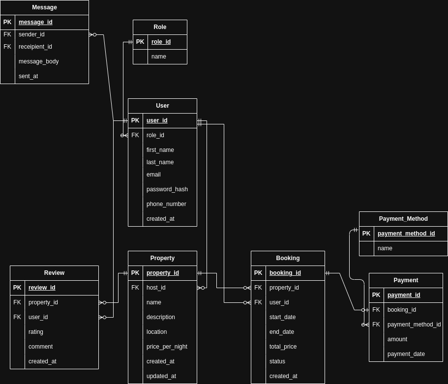

# Entities and Relationships – Airbnb Schema

## 📦 Entities and Attributes

### 1. `Roles`
| Attribute     | Type      | Description                     |
|---------------|-----------|---------------------------------|
| `role_id`     | UUID (PK) | Unique ID for each role         |
| `role_name`   | VARCHAR   | Role name (e.g., guest, host)   |

---

### 2. `Users`
| Attribute         | Type      | Description                                |
|------------------|-----------|--------------------------------------------|
| `user_id`        | UUID (PK) | Unique user ID                             |
| `first_name`     | VARCHAR   | User's first name                          |
| `last_name`      | VARCHAR   | User's last name                           |
| `email`          | VARCHAR   | Unique email address                       |
| `password_hash`  | VARCHAR   | Hashed user password                       |
| `phone_number`   | VARCHAR   | Optional phone number                      |
| `role_id`        | UUID (FK) | Role assigned (references `Roles`)         |
| `created_at`     | TIMESTAMP | Account creation time                      |

---

### 3. `Properties`
| Attribute         | Type      | Description                                |
|------------------|-----------|--------------------------------------------|
| `property_id`    | UUID (PK) | Unique property ID                         |
| `host_id`        | UUID (FK) | References `Users(user_id)`                |
| `name`           | VARCHAR   | Property title                             |
| `description`    | TEXT      | Detailed property description              |
| `location`       | VARCHAR   | Property address or location               |
| `price_per_night`| DECIMAL   | Cost per night                             |
| `created_at`     | TIMESTAMP | Date of property listing                   |
| `updated_at`     | TIMESTAMP | Last updated timestamp                     |

---

### 4. `Bookings`
| Attribute      | Type      | Description                                 |
|---------------|-----------|----------------------------------------------|
| `booking_id`  | UUID (PK) | Unique booking ID                            |
| `property_id` | UUID (FK) | References `Properties(property_id)`         |
| `user_id`     | UUID (FK) | References `Users(user_id)`                  |
| `start_date`  | TIMESTAMP | Check-in date                                |
| `end_date`    | TIMESTAMP | Check-out date                               |
| `total_price` | DECIMAL   | Total cost for the stay                      |
| `status`      | VARCHAR   | Booking status (pending, confirmed, canceled)|
| `created_at`  | TIMESTAMP | Time of booking creation                     |

---

### 5. `PaymentMethods`
| Attribute            | Type      | Description                               |
|----------------------|-----------|-------------------------------------------|
| `payment_method_id`  | UUID (PK) | Unique ID for the payment method          |
| `name`               | VARCHAR   | Name of the method (e.g., PayPal)         |

---

### 6. `Payments`
| Attribute           | Type      | Description                                     |
|---------------------|-----------|-------------------------------------------------|
| `payment_id`        | UUID (PK) | Unique payment ID                               |
| `booking_id`        | UUID (FK) | References `Bookings(booking_id)`               |
| `payment_method_id` | UUID (FK) | References `PaymentMethods(payment_method_id)`  |
| `amount`            | DECIMAL   | Payment amount                                  |
| `payment_date`      | TIMESTAMP | Time of payment                                 |

---

### 7. `Reviews`
| Attribute      | Type      | Description                                |
|----------------|-----------|--------------------------------------------|
| `review_id`    | UUID (PK) | Unique review ID                           |
| `property_id`  | UUID (FK) | References `Properties(property_id)`       |
| `user_id`      | UUID (FK) | References `Users(user_id)`                |
| `rating`       | INTEGER   | Rating value (1 to 5)                      |
| `comment`      | TEXT      | Review comment                             |
| `created_at`   | TIMESTAMP | Time review was posted                     |

---

### 8. `Messages`
| Attribute       | Type      | Description                                |
|------------------|-----------|--------------------------------------------|
| `message_id`     | UUID (PK) | Unique message ID                          |
| `sender_id`      | UUID (FK) | References `Users(user_id)` (sender)       |
| `recipient_id`   | UUID (FK) | References `Users(user_id)` (recipient)    |
| `body`           | TEXT      | Message content                            |
| `sent_at`        | TIMESTAMP | Time the message was sent                  |

---

## 🔗 Entity Relationships

| Relationship                      | Type                      | Description                                                  |
|----------------------------------|---------------------------|--------------------------------------------------------------|
| `Users` → `Roles`                | Many-to-One               | Each user has one role.                                      |
| `Properties` → `Users`           | Many-to-One               | Each property belongs to one host (user).                    |
| `Bookings` → `Users`             | Many-to-One               | Each booking is made by a user (guest).                      |
| `Bookings` → `Properties`        | Many-to-One               | Each booking is for a specific property.                     |
| `Payments` → `Bookings`          | Many-to-One               | Each payment is tied to a booking.                           |
| `Payments` → `PaymentMethods`    | Many-to-One               | Each payment uses a payment method.                          |
| `Reviews` → `Properties`         | Many-to-One               | Each review is written for a property.                       |
| `Reviews` → `Users`              | Many-to-One               | Each review is written by a user.                            |
| `Messages` → `Users` (sender)    | Many-to-One (self-ref)    | Each message is sent by a user.                              |
| `Messages` → `Users` (recipient) | Many-to-One (self-ref)    | Each message is received by a user.                          |

---

## ER Diagram

